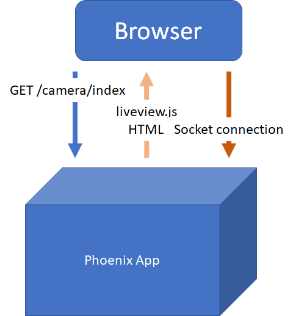
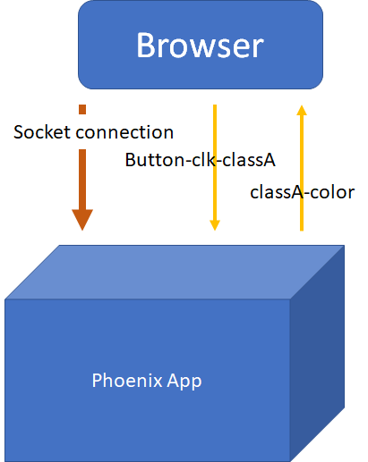
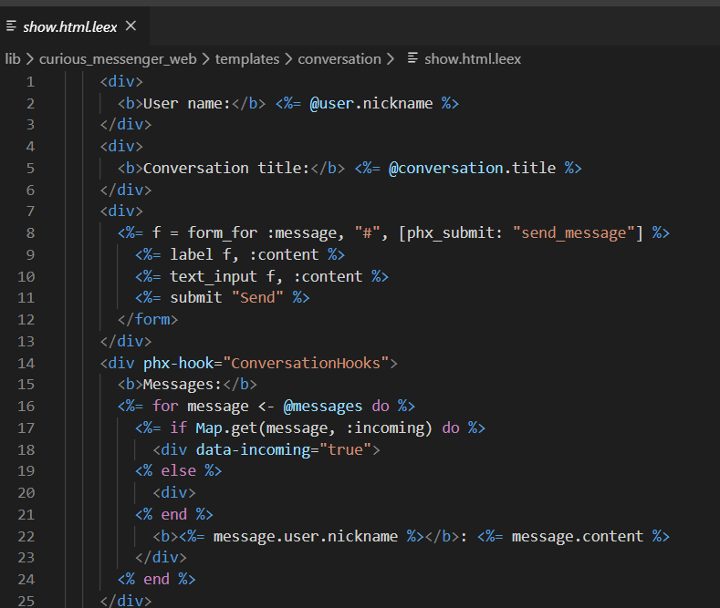

## Intro

Scott Mueller

### Knowfalls.com
---
## Tampa Elixir

Looking for Presenters


---
## Overview of Phoenix Liveview

* Example Applications
* How Liveview Works
* Code Snippets
* Liveview Use Cases
* Liveview Limitations
* AI and Liveview
* Strengths of Liveview

---
## Example Applications

https://curiosum.dev/blog/elixir-phoenix-liveview-messenger-part-1

https://dev.to/petecorey/animating-a-canvas-with-phoenix-liveview-1m8i

https://liveview-pixelart.herokuapp.com/nashfp

live draw

---
## https://phoenixphrenzy.com/results

---
## Page Load


---
## Messages Over Socket


---
## .leex


---
## Bindings

```html
<button phx-click="inc_temperature">+</button>
```
---
## Binding Handler

All via handle_event callback

```elixir
def handle_event("inc_temperature", _value, socket) do
  {:ok, new_temp} = Thermostat.inc_temperature(socket.assigns.id)
  {:noreply, assign(socket, :temperature, new_temp)}
end
```
---
## Binding:Attribute

| Binding  | Attribute |
| ------------- | ------------- |
|Params	|phx-value-*|
|Click Events	|phx-click|
|Focus/Blur Events	|phx-blur, phx-focus, phx-target|
|Form Events	|phx-change, phx-submit, data-phx-error-for, phx-disable-with|

---
| Binding  | Attribute |
| ------------- | ------------- |
|Key Events	|phx-keydown, phx-keyup, phx-target|
|Rate Limiting	|phx-debounce, phx-throttle|
|Custom DOM Patching	|phx-update|
|JS Interop	|phx-hook|
---
## Liveview Use Cases

* Inputs, buttons forms
  - input validation, dynamic forms, autocomplete

* Page and data navigation

---
## Liveview Limitations

* Needs connection reliability
* Needs low connection latency or can tolerate lag
* Animations handled elsewhere, CSS transitions

---
## Strengths of Liveview

* Display interactions pushed to client
  - Chat, monitoring events, sharing interactively

* AI systems where AI is major actor on system

---
## Example Application

https://github.com/meanderingstream/image_anno

---

[Knowfalls.com](https://knowfalls.com/)

###### scottmueller@knowfalls.com

Looking for Founder Engineers

Elixir, Functional Programming, Rails, Experience

---
